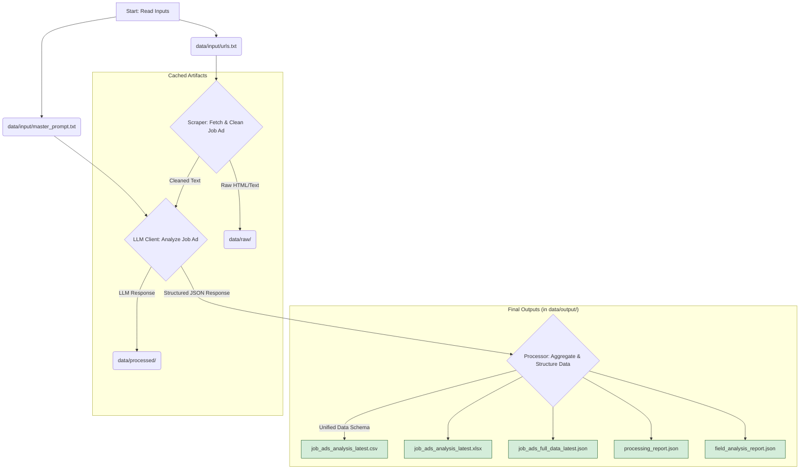

# Personalized Job Ad Analyzer 🤖

This project is an automated pipeline that scrapes job advertisements from a list of URLs, analyzes them against a personalized candidate profile using a Large Language Model (LLM), and outputs a structured, actionable analysis in multiple formats.

It's designed to move beyond simple data extraction and provide a deep, personal assessment of job suitability, growth potential, and salary expectations.

## ✨ Core Features

* **Personalized Analysis**: Analyzes job ads through the lens of a specific candidate profile defined in the master prompt.
* **Intelligent Web Scraping**: Scrapes content from URLs with specific selectors for major job boards (LinkedIn, Indeed) and robust fallback strategies.
* **Advanced Caching**: Caches scraped content and LLM responses to prevent redundant processing and minimize API costs. You can override this with a `--force` flag.
* **Structured LLM Output**: Uses a detailed prompt to instruct the LLM to return a structured, nested JSON, which is then flattened for easy analysis.
* **Multi-Format Reports**: Generates `.csv`, `.xlsx` (with multiple sheets for data and field analysis), and `.json` reports.
* **Robust & Configurable**: Centrally manage all settings in `config.py`, with built-in retries, error handling, and detailed logging.
* **Debugging Tools**: Includes helper scripts to debug malformed LLM JSON responses and fix text encoding issues for special characters.

---

## Workflow Diagram

The diagram below illustrates the complete data flow from input files to the final generated reports.



---

## 🚀 Getting Started

### 1. Prerequisites

* Python 3.8+
* An OpenAI API key (or a key for a compatible LLM endpoint).

### 2. Installation & Setup

1.  **Clone the repository:**
    ```bash
    git clone <your-repository-url>
    cd job-ad-analyzer
    ```

2.  **Create a virtual environment:**
    ```bash
    python -m venv venv
    source venv/bin/activate  # On Windows: venv\Scripts\activate
    ```

3.  **Install dependencies:**
    ```bash
    pip install -r requirements.txt
    ```

4.  **Set up environment variables:**
    * Copy the example file: `cp .env.example .env`
    * Edit the new `.env` file to add your `OPENAI_API_KEY`.

### 3. Usage

1.  **Add URLs**: Populate `data/input/urls.txt` with the job ad URLs you want to analyze (one per line). Lines starting with `#` are ignored.
2.  **Customize Your Profile**: Edit `data/input/master_prompt.txt` to replace the sample candidate profile with your own skills, experience, and background. This is the most critical step for personalized results.
3.  **Run the Pipeline**:
    ```bash
    python main.py
    ```
    The script will process each URL and save the final reports in the `data/output/` folder.

4.  **Force Re-processing**: To ignore all caches and re-process every URL from scratch, use the `--force` flag:
    ```bash
    python main.py --force
    ```